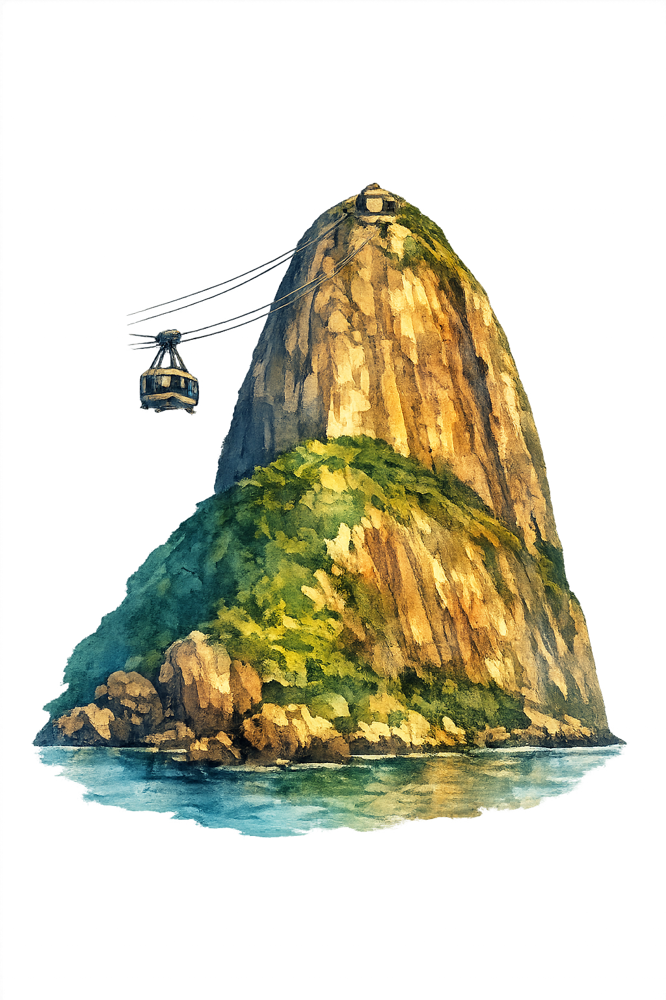

<div>
<a href="./README.md">
  
</a>
<a href="./README_EN.md">
  
</a>
</div>

<div>

</div>

## Sobre mim 

```python

from datetime import date

nome = "João Vítor Teodoro Santos"
nascimento = date(2000, 9, 10)
formacoes = [
    "- Bacharel em Administração - UFU",
    "- Graduando em Ciência de Dados - UNIUBE",
    "- Graduando em Sistemas da Informação - UFU",
]
interesse = "Qualidade de Software (QA), Desenvolvimento e Engenharia de Software"
sonho = "viajar o mundo"

def apresentacao(nome: str, nascimento: date, formacoes: list[str], interesse: str, sonho: str) -> str:
    mensagem = (
        f"Nome: {nome} || Idade: {(date.today() - nascimento).days // 365} anos\n\n"
        f"Formações:\n{"\n".join(formacoes)}"
        f"\n\nInteresses atuais: {interesse}\n\n"
        f"Maior sonho: {sonho}"
    )
    return mensagem

if __name__ == "__main__":
    print(apresentacao(nome, nascimento, formacoes, interesse, sonho))

```

## Linguagens

💪 **Principal:**


👆 **Já utilizadas em oportunidades:**


🧠 **Sem experiência mas já estudei:**


## Estatísticas

<div align="left">

<div>


</div>

<br>

<div>


</div>

<br>

<div>



</div>

</div>


## Redes Sociais

<div>
<a href="https://www.linkedin.com/in/joao-vitor-teodoro-santos/">
  
</a>
</div>
